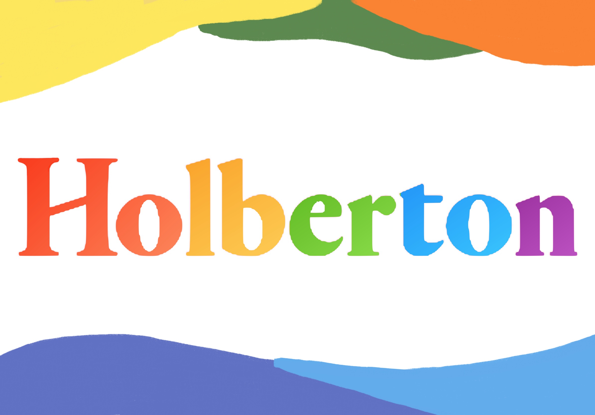
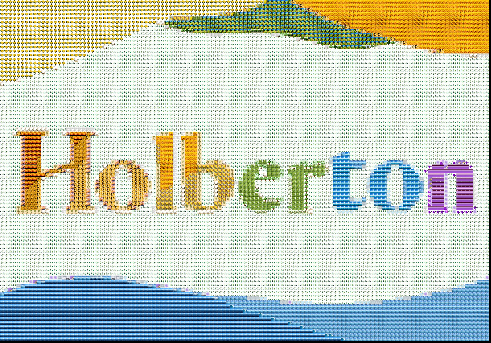

# Fotomosaicos con python3

## Introducción
Este proyecto fue construido solo para fines académicos. Todas las imágenes que se utilicen para construir el fotomosaico quedan sujetas a derecho de autor.

El código que encontraras recibe una imagen en jpg como input y generara un fotomosaico como output en formato jpg.

## Tener en cuenta
* En el archivo *main.py* debes indicar los temas para que el web crawler busque y extraiga las fotos. Si quieres montar tus propias imágenes, debes de comentar la función "download_images" y almacenar los documentos en la carpeta image_pool.
* El código te preguntará que si tu imagen se encuentra en escala de grises. En caso de ser afirmativo, las imágenes de la carpeta serán transformadas a escala de grises.
* En *photomosaic_generator.py* podrás aumentar o disminuir el valor del parámetro *stride*. Cuanto mayor sea el valor, mayor será la definición de las imágenes que componen el fotomosaioc.

## Ejemplo
### input:

### output
